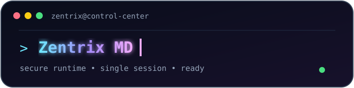

# Zentrix MD v1.01

<p align="center">
  
</p>

<p align="center">
  <strong>Secure. Fast. Built for control.</strong><br />
  A focused WhatsApp automation runtime with a clean terminal-first experience.
</p>

<p align="center">
  <a href="https://github.com/zentrix-tech2/zentrix-md">Repository</a>
  ·
  <a href="https://whatsapp.com/channel/0029VbCjCq80LKZ4i4iWHq22">WhatsApp Channel</a>
  ·
  <a href="https://t.me/zentrix_tech">Telegram</a>
</p>

---

## Overview

**Zentrix MD** is a Node.js WhatsApp automation project designed around a simple principle: the runtime should feel powerful without becoming difficult to operate. The v1.01 release focuses on a clear pairing flow, a single primary session, a responsive terminal experience, and a practical command surface.

The public repository intentionally contains only the launcher and package metadata. Private credentials, runtime state, deployment endpoints, and other operational material should never be committed to a public repository.

## Quick start

Install dependencies once in the deployment directory:

```bash
npm install
```

Start the runtime:

```bash
node index.js
```

After the one-time install, keep the recurring process command as `node index.js`. Do not reinstall packages during every restart.

## Pairing

When no primary session exists, Zentrix MD presents the pairing flow in the terminal. Choose phone-number pairing, then enter the WhatsApp number in full international format with the country code, without the leading `+` or spaces. Once pairing succeeds, the runtime sends a confirmation message to the paired WhatsApp chat.

If a primary session already exists, the runtime restores that session directly instead of opening a multi-session chooser.

## Runtime notes

| Area | Behavior |
| --- | --- |
| Startup | `node index.js` is the recurring startup command. |
| Sessions | One primary WhatsApp session is restored automatically. |
| Terminal | The runtime prints readable stage progress and keeps the latest output visible in the dashboard terminal. |
| Configuration | Keep private operational values outside Git. |
| Node.js | Node.js 18 or newer is recommended. |

## Community

Follow release notes, updates, and support announcements through the official channels:

- [Zentrix MD on WhatsApp](https://whatsapp.com/channel/0029VbCjCq80LKZ4i4iWHq22)
- [Zentrix Tech on Telegram](https://t.me/zentrix_tech)

<p align="center">
  <sub>© Zentrix Tech · Zentrix MD v1.01</sub>
</p>
